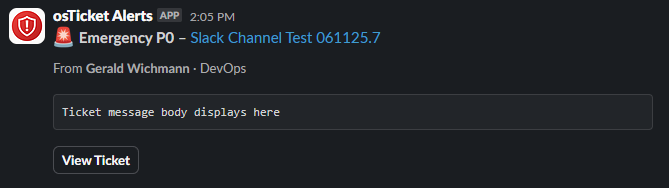
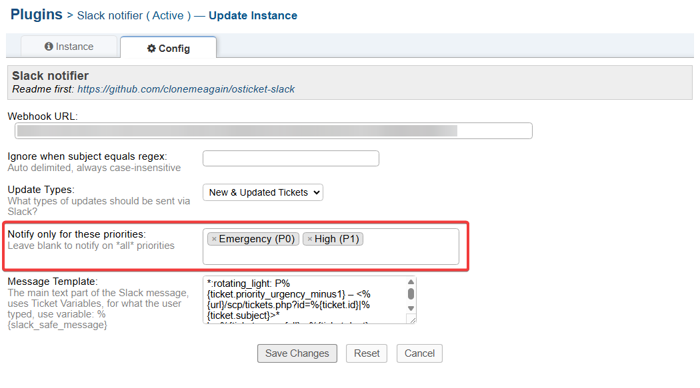

osTicket-slack
==============
A plugin for [osTicket](https://osticket.com) which posts notifications to a [Slack](https://slack.com) channel.

Info
------
This plugin uses CURL and was designed/tested with osTicket-1.18.2, PHP 8.3

|  |  |
|--|--|
|  | **Card highlights**<br>• urgency emoji 🔴🟠<br>• bold priority + subject link<br>• requester & department<br>• first 500 chars quoted<br>• **View Ticket** button<br>• coloured stripe (*fuchsia when overdue*) |

## What’s new in this fork

* **Priority whitelist** – choose exactly which priorities trigger Slack.  
* **Block-Kit layout** instead of legacy attachments.  
* **Urgency emoji & colour map.**  
* PHP-8 compatible.

---

## Requirements

* osTicket 1.17 or 1.18  
* PHP `curl` extension  
* Slack workspace with an **Incoming Webhook**

## Install

1. Clone this repo or download the zip file and place the contents into your `include/plugins` folder.
1. Now the plugin needs to be enabled & configured, so login to osTicket, select "Admin Panel" then "Manage -> Plugins" you should be seeing the list of currently installed plugins.
1. Click on `Slack Notifier` and paste your Slack Endpoint URL into the box (Slack setup instructions below).
1. Click `Save Changes`! (If you get an error about curl, you will need to install the Curl module for PHP). 
1. After that, go back to the list of plugins and tick the checkbox next to "Slack Notifier" and select the "Enable" button.


## Slack Setup:
- Navigate to https://api.slack.com/ select "Start Building"
- Name your App `osTicket Notification`, select your Workspace from the drop-down
- Select "Incoming Webhooks"
- Activate the Webhooks with the link (it defaults to Off, just click Off to change it to On)
- Scroll to the bottom and select "Add a new Webhook to Workspace"
- Select the endpoint of the webhook, (ie, channel to post to)
- Select "Authorize"
- Scroll down and copy the Webhook URL entirely, paste this into the `osTicket -> Admin -> Plugin -> Slack` config admin screen.

If you want to add the Department as a field in each slack notice, tick the Checkbox in the Plugin config.

The channel you select will receive an event notice, like:
```
Aaron [10:56 AM] added an integration to this channel: osTicket Notification
```
You should also receive an email from Slack telling you about the new Integration.


## Discord Setup:
Note: This works very well, but may not be as smooth as Slack is natively.

- Open Discord
- Right-click on the channel you wish to send the notifications too
- Select "Webhooks"
- Create a Webhook by clicking 'Create Webhook'
- Scroll down to the bottom and copy the Webhook URL in it's entireity
- Go to the `osTicket -> Admin -> Plugin -> Slack` config admin screen and paste the URL, at the end add `/slack`
- Example: https://discordapp.com/api/webhooks/{webhook.id}/{webhook.token}/slack

## Test!
Create a ticket!

Notes, Replies from Agents and System messages shouldn't appear, usernames are links to the user's page 
in osTicket, the Ticket subject is a link to the ticket, as is the ticket ID. 

## Contributing

- PRs welcome – please target the main branch.
- Open an issue for bugs or feature requests.
- MIT licence like the original project.

If you improve the plugin (new events, Teams/Discord version, etc.) please link back so others can find your fork.

## Version history

| Version | Date&nbsp;(YYYY-MM-DD) | Highlights |
|---------|-----------------------|------------|
| 0.4 | 2025-06-11 | priority whitelist, Block-Kit layout, urgency colours |
| 0.3 | 2025-06-10 | initial fork from **clonemeagain/osticket-slack** |
| 0.2 | 2016-12-17 | upstream: subject-regex filter |
| 0.1 | 2016-06-08 | first public release |


## Priority whitelist feature


